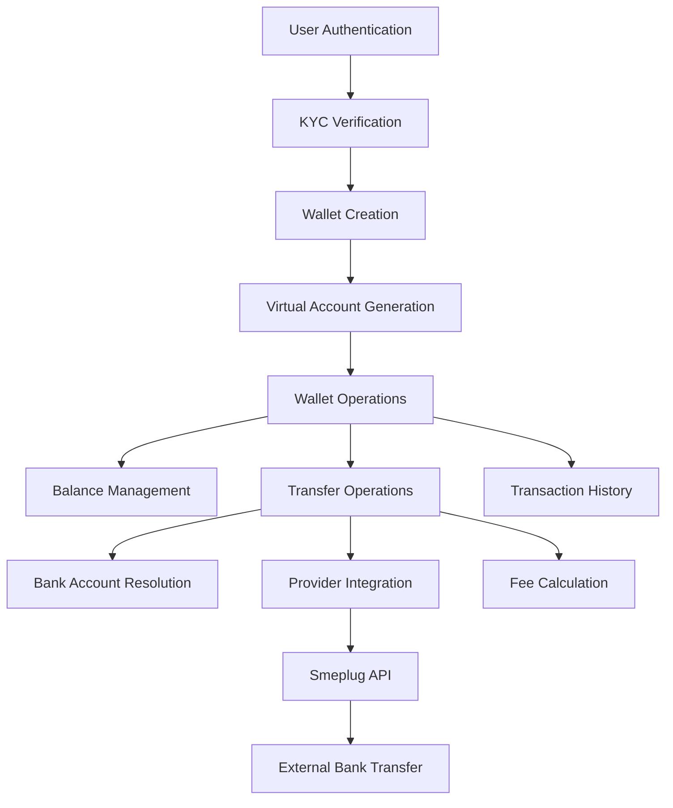

# SnapNGo Wallet System Documentation

## 🎯 Overview

The SnapNGo Wallet System is a comprehensive internal managed wallet solution that allows users to store funds, make transfers to bank accounts, and manage their financial transactions seamlessly. The system integrates with KYC verification, OCR-based bank account resolution, and external payment providers.

## 🏗️ System Architecture

### Core Components



### Database Schema

#### Core Models

**Wallet Model**
```prisma
model Wallet {
  id                   String   @id @default(cuid())
  userId               String   @unique
  balance              Float    @default(0.00)
  currency             String   @default("NGN")
  
  // Virtual account details
  virtualAccountNumber String?  @unique
  providerId          String?
  providerAccountName String?
  
  // Security
  pin                 String?  // Hashed 4-digit PIN
  isActive            Boolean  @default(true)
  
  // Limits
  dailyLimit          Float    @default(100000)
  monthlyLimit        Float    @default(1000000)
  
  // Relations
  user                User     @relation(fields: [userId], references: [id])
  sentTransactions    WalletTransaction[] @relation("SenderWallet")
  receivedTransactions WalletTransaction[] @relation("ReceiverWallet")
}
```

**WalletTransaction Model**
```prisma
model WalletTransaction {
  id          String                 @id @default(cuid())
  amount      Float
  type        WalletTransactionType  // FUNDING, WITHDRAWAL, TRANSFER, REVERSAL, FEE
  status      TransactionStatus      // PENDING, PROCESSING, COMPLETED, FAILED
  reference   String                 @unique
  description String?
  fee         Float                  @default(0)
  
  // Audit trail
  senderBalanceBefore   Float?
  senderBalanceAfter    Float?
  receiverBalanceBefore Float?
  receiverBalanceAfter  Float?
  
  // Provider details
  providerReference String?
  providerResponse  Json?
  
  // Relations
  senderWallet   Wallet? @relation("SenderWallet")
  receiverWallet Wallet? @relation("ReceiverWallet")
  bankAccount    Account?
}
```

## 🔄 Complete User Flow

### 1. Wallet Creation Flow
```
User Registration → Email Verification → KYC Process → Wallet Creation
```

1. **User Registration**: Standard email/password registration
2. **KYC Verification**: 
   - BVN verification with provider
   - Selfie upload with face matching
3. **Automatic Wallet Creation**: 
   - Triggered after successful KYC completion
   - Virtual account number generated (format: 903XXXXXXX)
   - Provider account setup initiated

### 2. Transfer Flow (Core Feature)
```
Photo Capture → OCR Extraction → Account Resolution → Amount Entry → Balance Check → Transfer Execution
```

**Detailed Steps:**

1. **Photo Capture & OCR**
   ```
   User takes photo of bank account details
   ↓
   OCR extracts account number and bank name
   ↓
   /accounts/resolve API validates and returns account holder name
   ```

2. **Transfer Request**
   ```
   User enters:
   - Transfer amount
   - Optional description
   - 4-digit wallet PIN
   
   System validates:
   - PIN verification
   - Sufficient balance (amount + fee)
   - Account details
   ```

3. **Transfer Execution**
   ```
   Fee calculation (1.5% min ₦25)
   ↓
   Provider API call (Smeplug)
   ↓
   On success: Deduct from wallet + Create transaction record
   ↓
   Return updated balance and transaction reference
   ```

## 🛠️ API Endpoints

### Wallet Management

#### GET `/wallet/details`
**Purpose**: Get complete wallet information including balance and account details

**Response:**
```json
{
  "id": "wallet_id",
  "balance": 5000.00,
  "currency": "NGN",
  "virtualAccountNumber": "9038123456",
  "providerAccountName": "John Doe",
  "isActive": true,
  "dailyLimit": 100000,
  "monthlyLimit": 1000000,
  "lastTransactionAt": "2024-01-15T10:30:00Z",
  "createdAt": "2024-01-01T00:00:00Z"
}
```

#### GET `/wallet/balance`
**Purpose**: Quick balance check with formatted display

**Response:**
```json
{
  "balance": 5000.00,
  "currency": "NGN",
  "formattedBalance": "₦5,000.00"
}
```

#### POST `/wallet/set-pin`
**Purpose**: Set or update 4-digit wallet PIN

**Request:**
```json
{
  "pin": "1234"
}
```

**Response:**
```json
{
  "success": true,
  "message": "Wallet PIN set successfully"
}
```

### Transfer Operations

#### POST `/wallet/transfer`
**Purpose**: Transfer money from wallet to external bank account

**Request:**
```json
{
  "amount": 1000.00,
  "accountNumber": "0123456789",
  "bankName": "First Bank of Nigeria",
  "accountName": "John Doe",
  "description": "Payment for services",
  "pin": "1234"
}
```

**Response:**
```json
{
  "success": true,
  "message": "Transfer completed successfully",
  "reference": "TXN_1234567890",
  "amount": 1000.00,
  "fee": 50.00,
  "newBalance": 4000.00,
  "recipientName": "John Doe",
  "recipientAccount": "0123456789",
  "recipientBank": "First Bank of Nigeria"
}
```

### Transaction History

#### GET `/wallet/transactions?limit=20&offset=0`
**Purpose**: Get paginated wallet transaction history

**Response:**
```json
[
  {
    "id": "txn_id",
    "amount": 1000.00,
    "type": "WITHDRAWAL",
    "status": "COMPLETED",
    "reference": "TXN_1234567890",
    "description": "Transfer to John Doe",
    "fee": 50.00,
    "createdAt": "2024-01-15T10:30:00Z",
    "sender": {
      "name": "Jane Smith",
      "accountNumber": "9038123456"
    },
    "receiver": null,
    "bankAccount": {
      "accountName": "John Doe",
      "accountNumber": "0123456789",
      "bankName": "First Bank of Nigeria"
    }
  }
]
```

## 💰 Fee Structure

### Transfer Fees
- **Rate**: 1.5% of transfer amount
- **Minimum**: ₦25.00
- **Maximum**: No limit (scales with amount)

**Examples:**
- Transfer ₦1,000 → Fee: ₦25 (minimum applied)
- Transfer ₦5,000 → Fee: ₦75 (1.5%)
- Transfer ₦10,000 → Fee: ₦150 (1.5%)

### Fee Calculation Logic
```typescript
const feePercentage = 0.015; // 1.5%
const fee = Math.max(amount * feePercentage, 25); // Minimum ₦25
const totalDeduction = amount + fee;
```

## 🔒 Security Features

### PIN Protection
- **Format**: 4-digit numeric PIN
- **Storage**: Bcrypt hashed (salt rounds: 10)
- **Validation**: Required for all transfers
- **Lockout**: Configurable failed attempt limits

### Balance Validation
- Real-time balance checking before transfers
- Atomic balance updates to prevent race conditions
- Complete audit trail with before/after balances

### Transaction Security
- Unique transaction references
- Idempotent operations
- Provider response logging
- Failed transaction tracking

## 🔗 External Integrations

### Bank Account Resolution
**Endpoint**: `/accounts/resolve`
**Purpose**: Validate bank account details and retrieve account holder name

**Integration Flow:**
```
User Input (Account + Bank) → Smart Bank Matching → Smeplug API → Account Name
```

**Supported Banks:**
- First Bank of Nigeria, GTBank, Access Bank, Zenith Bank
- UBA, Union Bank, Sterling Bank, Fidelity Bank
- FCMB, Wema Bank, Ecobank, Keystone Bank
- Fintech: Kuda, Opay, PalmPay, Moniepoint

### Provider Integration (Smeplug)
**Current Status**: Mock implementation ready for production API

**Transfer Request Format:**
```json
{
  "amount": 1000.00,
  "account_number": "0123456789",
  "bank_code": "011",
  "account_name": "John Doe",
  "reference": "TXN_1234567890",
  "narration": "Transfer from Jane Smith",
  "sender_name": "Jane Smith",
  "sender_email": "jane@example.com"
}
```

**Provider Response:**
```json
{
  "status": "success",
  "message": "Transfer completed successfully",
  "reference": "SMEPLUG_TXN_1234567890",
  "amount": 1000.00,
  "fee": 25.00,
  "recipient": {
    "accountNumber": "0123456789",
    "accountName": "John Doe",
    "bankCode": "011"
  },
  "timestamp": "2024-01-15T10:30:00Z"
}
```

## 📊 Transaction Lifecycle

### Transfer States
1. **PENDING**: Transaction initiated, validations in progress
2. **PROCESSING**: Sent to provider, awaiting response
3. **COMPLETED**: Successfully processed by provider
4. **FAILED**: Provider rejected or system error
5. **CANCELLED**: User or system cancellation

### State Management
```typescript
// Create pending transaction
const transaction = await prisma.walletTransaction.create({
  data: {
    amount,
    type: 'WITHDRAWAL',
    status: 'PENDING',
    reference: generateReference(),
    // ... other fields
  }
});

// Update on provider response
await prisma.walletTransaction.update({
  where: { id: transaction.id },
  data: {
    status: providerSuccess ? 'COMPLETED' : 'FAILED',
    providerReference: response.reference,
    providerResponse: response,
  }
});
```

## 🎯 Error Handling

### Common Error Scenarios

#### Insufficient Balance
```json
{
  "statusCode": 400,
  "message": "Insufficient balance. Required: ₦1,050.00, Available: ₦500.00",
  "error": "Bad Request"
}
```

#### Invalid PIN
```json
{
  "statusCode": 401,
  "message": "Invalid wallet PIN",
  "error": "Unauthorized"
}
```

#### Provider Failure
- Transaction marked as FAILED
- User notified with error details
- No balance deduction on failure
- Audit trail maintained

## 🚀 Next Phase Implementation

### Virtual Account Integration
1. **Provider Setup**: Real Smeplug API integration for virtual account generation
2. **Webhook Handler**: Automatic funding via provider webhooks
3. **Real-time Notifications**: Balance updates and transaction alerts

### Webhook Implementation
```typescript
@Post('/webhook/funding')
async handleFunding(@Body() webhook: FundingWebhook) {
  // Verify webhook signature
  // Update wallet balance
  // Create funding transaction record
  // Notify user
}
```

### Advanced Features
- **Recurring Transfers**: Scheduled payments
- **Spending Analytics**: Transaction categorization and insights
- **Multi-currency Support**: USD, EUR wallet support
- **Investment Integration**: Savings and investment products

## 📈 Monitoring & Analytics

### Key Metrics
- **Transaction Volume**: Daily/monthly transfer amounts
- **Success Rate**: Percentage of successful transfers
- **Average Transaction Size**: User spending patterns
- **Provider Performance**: Response times and success rates

### Logging Strategy
- Comprehensive console logging with emoji indicators
- Transaction audit trails
- Provider API call logging
- Error tracking and alerting

## 🔧 Development Notes

### Testing Strategy
- Unit tests for service methods
- Integration tests for API endpoints
- Mock provider responses for development
- End-to-end transfer flow testing

### Performance Considerations
- Database indexing on frequently queried fields
- Connection pooling for high-volume operations
- Caching for bank code mappings
- Async processing for provider calls

---

## 📞 Support & Troubleshooting

### Common Issues
1. **Wallet Not Found**: Ensure KYC is completed
2. **PIN Not Set**: Use `/wallet/set-pin` endpoint
3. **Transfer Failures**: Check balance and account details
4. **Provider Timeouts**: Retry mechanism implemented

### Debug Information
- Check server logs for detailed transaction flow
- Use Prisma Studio for database inspection
- Monitor provider API responses
- Transaction reference tracking

---

*This documentation covers the complete SnapNGo Wallet System implementation. For technical support or feature requests, please contact the development team.* 